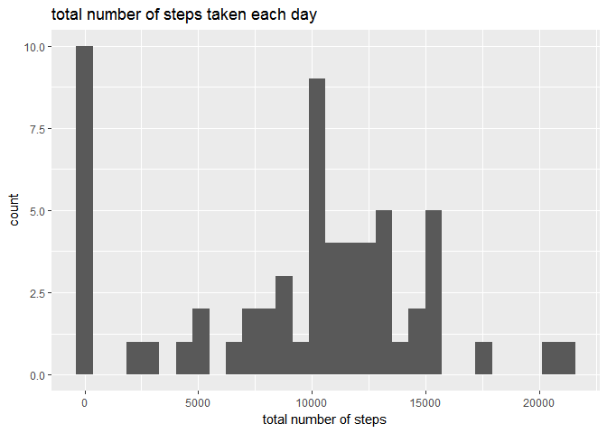
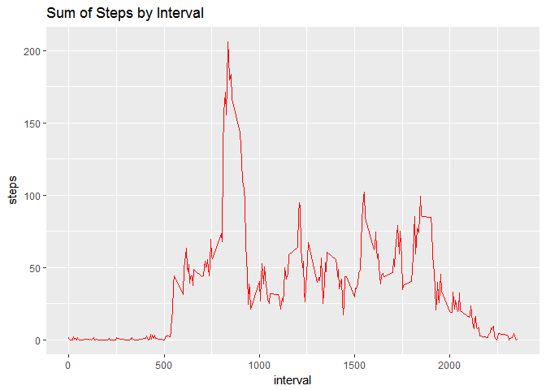
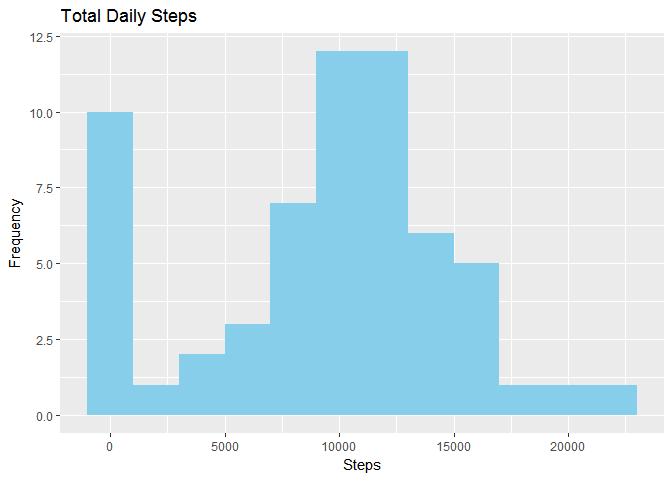
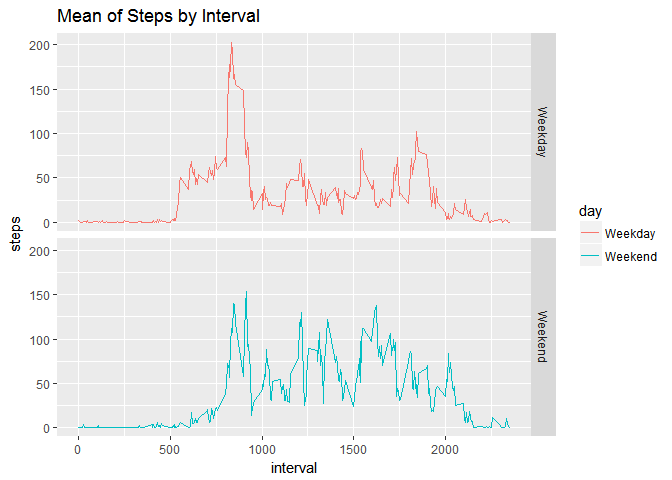

# Reproducible Research: Peer Assessment 1


## Loading and preprocessing the data

First load libraries, 


```r
library(ggplot2)
```

Unzip data  and read it in data.frame


```r
# Unzip archive
unzip("activity.zip")

# Read base data into a data frame.
baseData <- read.csv("activity.csv")
```

Check the structure of baseData.


```r
str(baseData)
```

```
## 'data.frame':	17568 obs. of  3 variables:
##  $ steps   : int  NA NA NA NA NA NA NA NA NA NA ...
##  $ date    : Factor w/ 61 levels "2012-10-01","2012-10-02",..: 1 1 1 1 1 1 1 1 1 1 ...
##  $ interval: int  0 5 10 15 20 25 30 35 40 45 ...
```


## What is mean total number of steps taken per day?

1. Calculate the total number of steps taken per day
To calculate mean of total number of steps taken per day, first aggregate steps based on dates .


```r
# Aggregate the number of steps (excluding number of steps)

totalSteps <- tapply(X = baseData$steps,INDEX = baseData$date,FUN = sum , na.rm =TRUE )
```

2. Make a histogram of the total number of steps taken each day
Next step draw the histograph.


```r
qplot(x = totalSteps ,  xlab="total number of steps", main ="total number of steps taken each day" )
```

```
## `stat_bin()` using `bins = 30`. Pick better value with `binwidth`.
```

<!-- -->

3. Calculate and report the mean and median of the total number of steps taken per day.

Lets save the value in variable and produce output with variable


```r
# Calculate Mean
stepsByDayMean <- mean(totalSteps )

# Calculate Median
stepsByDayMedian <- median(totalSteps )
```

The **mean** is 9354.2295082 and **median** is 10395

## What is the average daily activity pattern?


1. Make a time series plot (i.e. type = "l") of the 5-minute interval (x-axis) and the average number of steps taken, averaged across all days (y-axis)

- First create the data frame with summarized  dates and steps


```r
nonNASubset <- baseData[complete.cases(baseData),]
MeanDataByInterval <- aggregate(nonNASubset$steps, by=list(nonNASubset$interval), mean)
# set the column names
names(MeanDataByInterval)<- c("interval","steps")
```
- Next we plot the average daily steps against the intervals:

```r
ggplot(MeanDataByInterval, aes(x = interval, y=steps)) +
  labs(title = "Sum of Steps by Interval", x = "interval", y = "steps")+
  geom_line(color="red")
```

<!-- -->

2. Which 5-minute interval, on average across all the days in the dataset, contains the maximum number of steps?


```r
MeanDataByInterval[which.max(MeanDataByInterval$steps),]
```

```
##     interval    steps
## 104      835 206.1698
```

## Imputing missing values

1. Calculate and report the total number of missing values in the dataset (i.e. the total number of rows with NAs)


```r
sum(is.na(baseData))
```

```
## [1] 2304
```

 2. Devise a strategy for filling in all of the missing values in the dataset.


```r
#Lets Fill all the steps by minimum steps (not zero) 

min_steps <- min(baseData$steps[baseData$steps != 0],na.rm =  TRUE)
```

3. Create a new dataset that is equal to the original dataset but with the missing data filled in.


```r
#Create New dataset 

newData <- baseData

# replace all NA's

newData[is.na(newData),1] <- min_steps

tail(newData)
```

```
##       steps       date interval
## 17563     1 2012-11-30     2330
## 17564     1 2012-11-30     2335
## 17565     1 2012-11-30     2340
## 17566     1 2012-11-30     2345
## 17567     1 2012-11-30     2350
## 17568     1 2012-11-30     2355
```

4.Make a histogram of the total number of steps taken each day and Calculate and report the mean and median total number of steps taken per day. 

- First create aggrgated table with steps

```r
noStepsByDay <- aggregate(newData$steps, by=list(newData$date), sum)

names(noStepsByDay) <- c("date" ,"totalsteps")

head(noStepsByDay,n = 10)
```

```
##          date totalsteps
## 1  2012-10-01        288
## 2  2012-10-02        126
## 3  2012-10-03      11352
## 4  2012-10-04      12116
## 5  2012-10-05      13294
## 6  2012-10-06      15420
## 7  2012-10-07      11015
## 8  2012-10-08        288
## 9  2012-10-09      12811
## 10 2012-10-10       9900
```


- draw the graph


```r
ggplot(noStepsByDay, aes(x = totalsteps)) +
  geom_histogram(fill = "skyblue",binwidth=2000, position="dodge") +
  labs(title = "Total Daily Steps", x = "Steps", y = "Frequency")
```

<!-- -->


## Are there differences in activity patterns between weekdays and weekends?
1. Create a new factor variable in the dataset with two levels – “weekday” and “weekend” indicating whether a given date is a weekday or weekend day.


```r
# Get which day of week first and append to new column
newData$weekday <- weekdays(as.Date( newData$date))

# Now create new col. based on day of week if weekend or weekday

newData$weekend <- ifelse (newData$weekday == "Saturday" | newData$weekday == "Sunday", "Weekend", "Weekday")
```

2. Make a panel plot containing a time series plot (i.e. type = "l") of the 5-minute interval (x-axis) and the average number of steps taken, averaged across all weekday days or weekend days (y-axis).


```r
# Aggregate data based on day and interval
WeekendWeekday <- aggregate(newData$steps, by=list(newData$weekend, newData$interval), mean)
names(WeekendWeekday ) <- c("day","interval","steps")

# Draw chart
ggplot(WeekendWeekday, aes(x = interval, y=steps, color=day)) +
  geom_line() +
  facet_grid(day ~ .) +
  labs(title = "Mean of Steps by Interval", x = "interval", y = "steps")
```

<!-- -->

